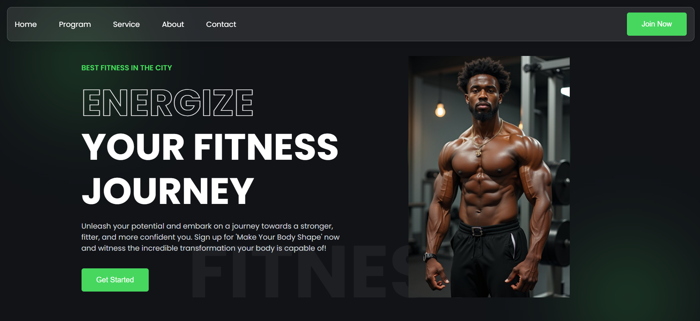
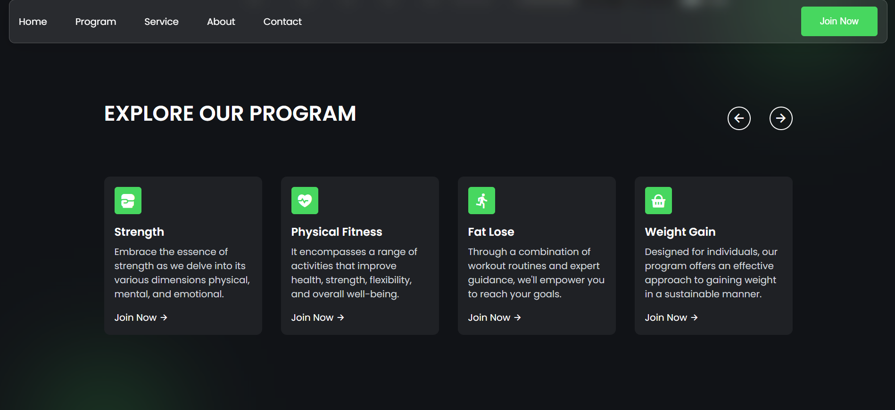
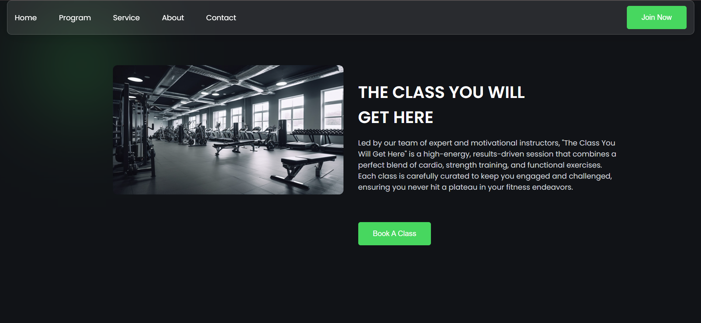
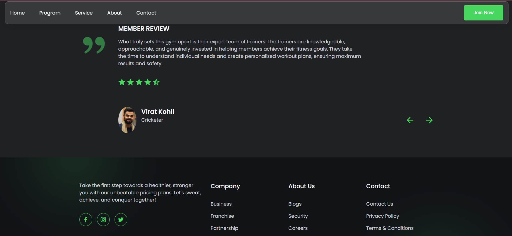

# 💪 BODY CRAFT GYM

**BodyCraft Gym** is a modern, responsive fitness website built using HTML and CSS. It showcases gym programs, pricing plans, class offerings, testimonials, and more in a clean, engaging layout. This project is part of open-source practice and frontend development learning.

---

## ✨ Features

| Category       | Feature                                  | Status     |
|----------------|------------------------------------------|------------|
| Landing Page   | Hero section with CTA                    | ✅ Done     |
| Programs       | Strength, Fat Loss, Weight Gain, etc.    | ✅ Done     |
| Class Section  | Trainer-led session showcase             | ✅ Done     |
| Join Section   | Cards explaining why to choose BodyCraft | ✅ Done     |
| Pricing        | Basic, Monthly, and Yearly plans         | ✅ Done     |
| Testimonial    | Member review with rating                | ✅ Done     |
| Responsive UI  | Mobile-friendly layout (CSS based)       | 🛠️ Planned  |

---

## 🛠️ Tech Stack

- HTML5
- CSS3
- [Remix Icon](https://remixicon.com/) (for icons)

---

### 📸 Screenshots

| Section                | Screenshot |
|------------------------|------------|
| 🏠 Landing Page        |  |
| 🧾 Programs Offered     |  |
| 🧑‍🏫 Class Showcase      |  |
| 👥 Why Join Us         |  |
| 💰 Pricing Plans       |  |
| 🌟 Review & Footer     |  |


```

## 📂 Folder Structure

BodyCraft-Gym/
├── assets/ #Images used in site
├── styles.css # Styling for the full website
├── index.html # Main HTML file
├── README.md # Project overview
├── CODE_OF_CONDUCT.md # Contributor behavior guide


```

## 🚀 Getting Started

---

## 🛠️ How to Use & Contribute

### 1. Clone

```bash
git clone https://github.com/your-username/BodyCraft-Gym.git
cd BodyCraft-Gym
```

### 2. Run Locally
Any static server works. With VS Code:

Install the Live Server extension

Right-click index.html → Open with Live Server

### 3. Contribute
Pick an issue labelled Level 1, Level 2, or Level 3

Create a feature branch:
```
git checkout -b feat/your-feature-name
```

## 🧑‍💻 Contribution Workflow

| Step | Description |
|------|-------------|
| 1️⃣  | **Fork** the repository |
| 2️⃣  | Create a new branch:<br>`git checkout -b your-feature-name` |
| 3️⃣  | Make your changes |
| 4️⃣  | Commit your changes:<br>`git commit -m "Add: feature description"` |
| 5️⃣  | Push to GitHub:<br>`git push origin your-feature-name` |
| 6️⃣  | Open a **Pull Request** on GitHub |


## 🛣️ Roadmap

| Feature/Task                                   |
|-----------------------------------------------|
| Make fully responsive for all devices          |
| Deploy via GitHub Pages                        |
| Add more sections (BMI calculator, Blog, Gallery) |


## 👥 Community & Support

| Channel             | Purpose                          |
|---------------------|----------------------------------|
| **GitHub Issues**   | Bug reports, feature requests    |
| **GitHub Discussions** | Q&A, ideas, polls            |
| **Discord**         | Real-time chat, pair programming |
| **GSSoC Mentors**   | Onboarding & code reviews        |

This project is a part of GirlScript Summer of Code (GSSoC). We're glad to support first-time contributors and open-source learners!

📄 License This project is open source and available under the MIT License.

⭐ If you like this project, don’t forget to star the repo and contribute!
